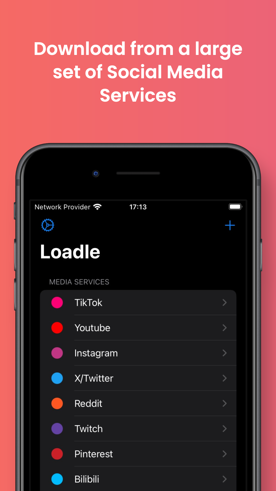
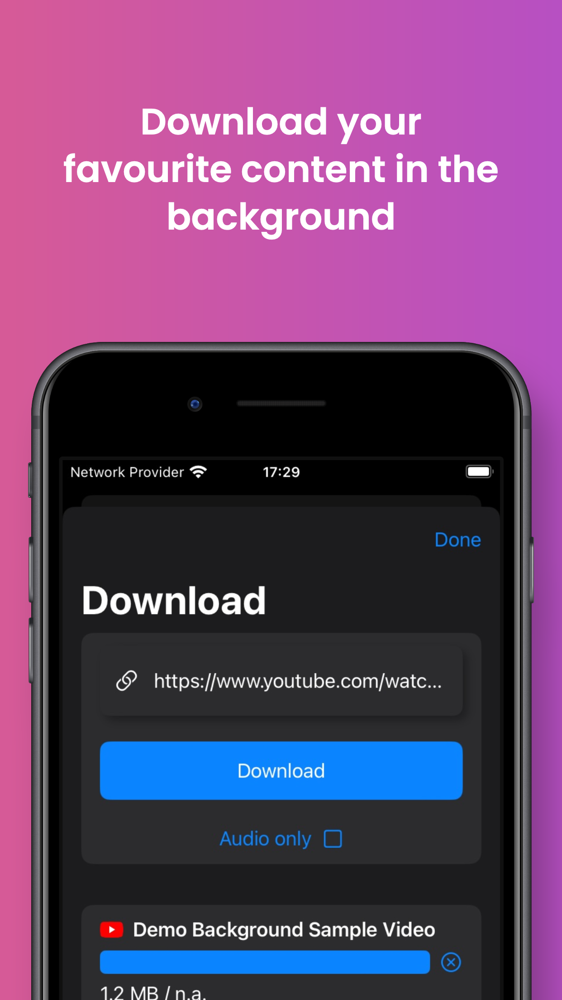
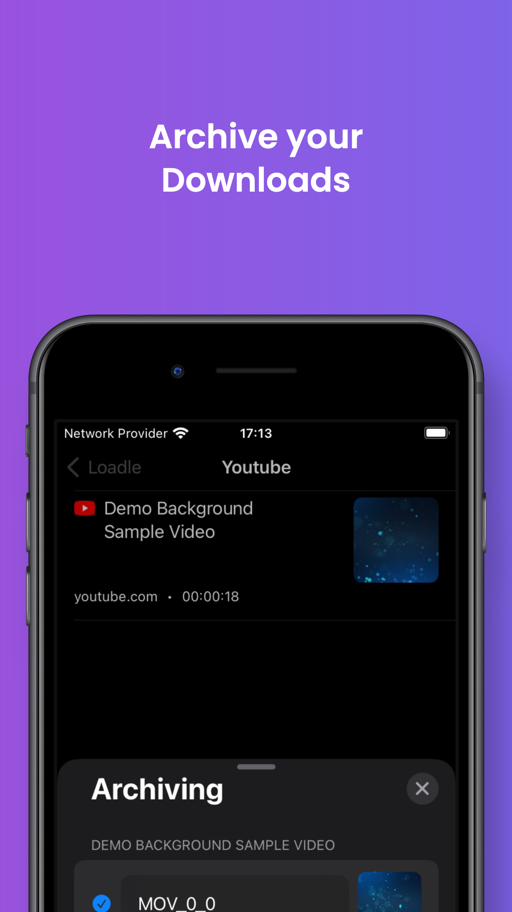
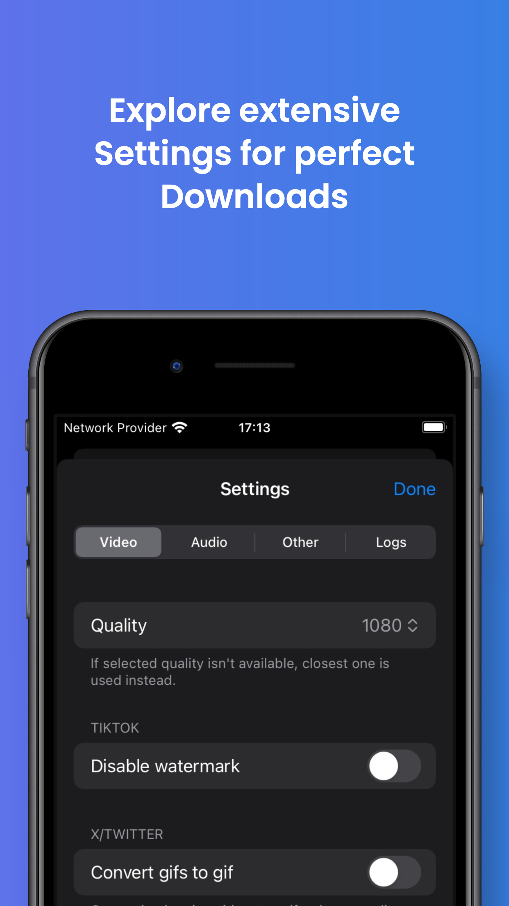

**Introducing Loadle: Your Ultimate Social Media Downloader**

Are you tired of jumping through hoops just to save your favorite content from various social media platforms? Bid farewell to the hassle with Loadle – your all-in-one solution for downloading from YouTube, TikTok, Instagram, SoundCloud, Twitter, and beyond.

|   |   |   |   |
|---|---|---|---|
|   |   |   |   |

### What is Loadle?

Loadle simplifies the process of saving content from social media. Videos, images, audio – you name it, Loadle delivers. Effortlessly download content from your preferred platforms with just a few taps.

### Key Features of Loadle:

1. **Tailored Downloads:** Customize your download preferences to suit your needs. High-quality videos or compressed images – you're in control with Loadle's versatile settings.

2. **Privacy Assurance:** Your privacy matters. Loadle respects your data, ensuring a safe and secure experience without compromising on functionality.

3. **One-Stop Solution:** Access content from multiple platforms in one convenient app. No more switching between apps – with Loadle, everything is at your fingertips.

4. **Intuitive Design:** Enjoy a seamless experience with Loadle's user-friendly interface. Whether you're a tech whiz or a casual user, downloading content has never been easier.

### How Does Loadle Work?

Using Loadle is a breeze. Simply paste the link to the content, adjust your settings, and hit download. Within moments, your content is saved and ready for offline enjoyment.

### Privacy
Your privacy matters. Your data won't be collected or stored. What you download is your business, not ours or anyone else's.

### Terms of Use

1. What You Download Is Your Responsibility

Loadle is not responsible for what you download or how you use it. Remember to be respectful and give credit to the original creators when using their content.

2. Legal Use Only

Loadle is not for piracy. It can only download free, publicly available content. This content can usually be downloaded using a web browser's tools. Loadle just makes it simpler by pressing a button.

3. Fair Use and Credit

Using content fairly and giving credit to creators helps everyone.

